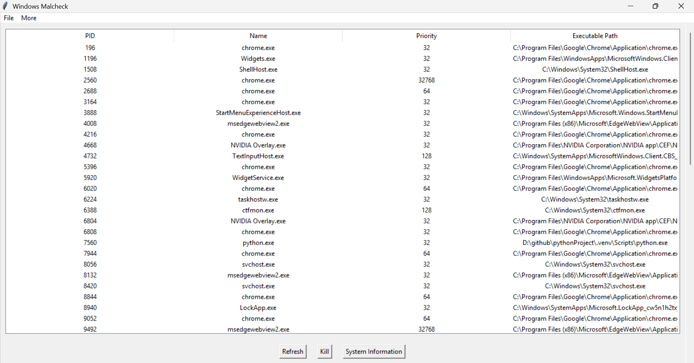
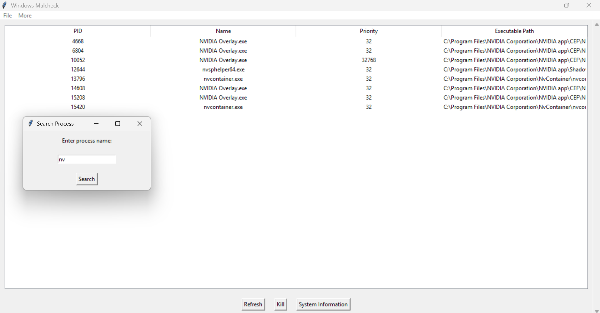
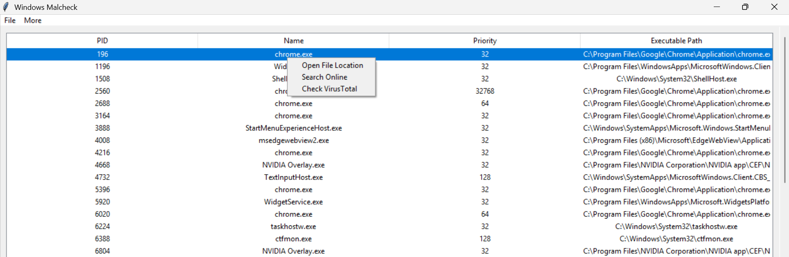
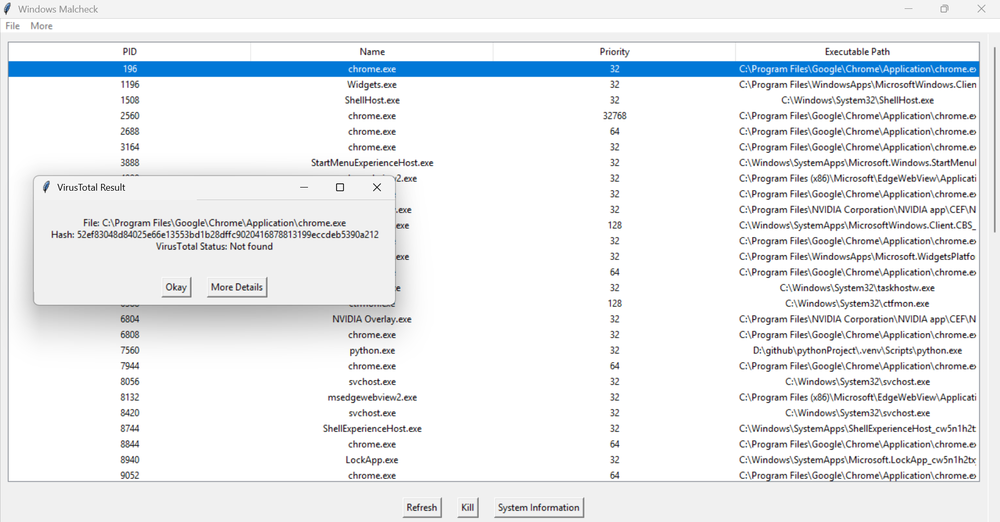
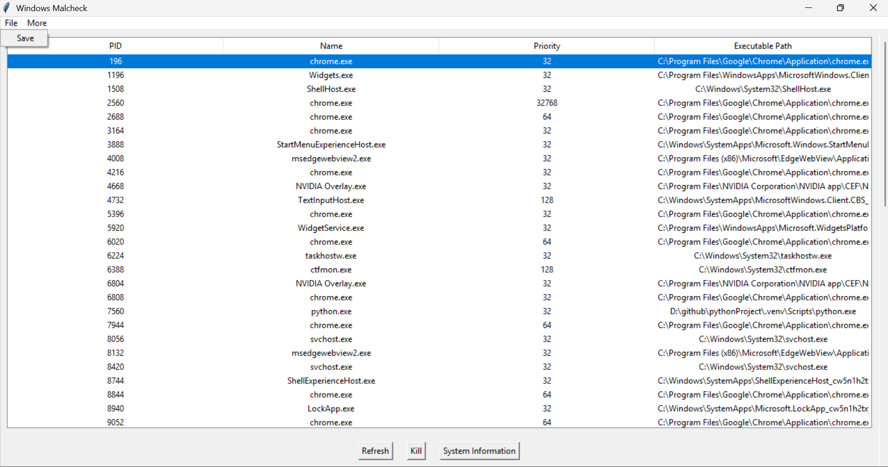

<p align="center">
  
</p>

<p align="center">
 
  
  
  
  
  
  
  
  
  

 
  
  
  
  
</p>


<p align="center">
  
  
  
  
</p>

# ✨ Windows Malcheck ✨

<p align="center">
  A glamorous , eye-catching Windows process monitoring & malware-check tool. 💻🔍
</p>

---

## 🚀 Features

* 🔄 **Refresh**: Instantly update the process list in real-time.
* 💀 **Kill**: Terminate suspicious processes (requires admin rights).
* 🖥️ **System Information**: View OS, hardware, and memory specs at a glance.
* 💾 **Save (CSV)**: Export the process list for **forensic analysis**.
* 🖱️ **Context Menu** (Right-click on a process):

  * 📂 Open File Location
  * 🌐 Search Online
  * 🛡️ Check VirusTotal
* 🕵️ **VirusTotal Integration**: SHA-256 hashing + threat status inline or detailed in browser.
* 🔍 **Hidden Search**: Press <kbd>Ctrl</kbd>+<kbd>F</kbd> to filter processes by name. (Surprise!)
* 🪟 **Windows License**: Quick view of Windows version from **More → Windows License**.
* ℹ️ **About**: Learn about the author & project.
* 🔄 **Update**: Navigate to the project homepage for the latest releases.

---

## 💾 Installation

1. **Clone** the repo:

   ```bash
   git clone https://github.com/shravankumaruk/windows-malcheck.git
   cd windows-malcheck
   ```
2. **Set up** a virtual environment (🌟 recommended):

   ```bash
   python -m venv venv
   # Activate:
   source venv/bin/activate      # Linux/macOS
   venv\\Scripts\\activate     # Windows PowerShell
   ```
3. **Install** dependencies:

   ```bash
   pip install -r requirements.txt
   ```

---

## ⚙️ Configuration

1. Open `malcheck.py` and locate the **API key** section:

   ```python
   # Your VirusTotal API key
   API_KEY = 'YOUR_API_KEY'
   ```
2. Replace `'YOUR_API_KEY'` with your own VirusTotal API key.

> 💡 **Tip**: Store your key in an environment variable or `.env` file for security.

---

## ▶️ Usage

```bash
python malcheck.py
```

1. 🖱️ Click **Refresh** to update the process list.
2. ✅ Select one or more processes and hit **Kill**.
3. 🖱️ Right-click any process to open context actions.
4. 🔍 Press <kbd>Ctrl</kbd>+<kbd>F</kbd> to **search** processes by name.
5. 💾 Under **File → Save**, export to CSV for deeper forensic work.
6. 📂 Use **More** for Windows License, About, or Update.

---

## 📸 Screenshots

<p align="center"><strong>Preview of Windows Malcheck Interface</strong></p>

<p align="center">
  <br><br>
  <br><br>
  <br><br>
  <br><br>
  
</p>


---

## 🔍 Forensics Analysis

* **Export & Inspect**: Dive into CSV data—timestamps, priorities, paths.
* **Locate & Research**: Jump to file folders or Google suspicious names.
* **VirusTotal Flagging**: Prevent malware before deep-dive investigations.

---

💡 **Got feedback, found a bug, or want a new feature?** Feel free to [open an issue](https://github.com/shravankumaruk/windows-malcheck/issues) on GitHub at any time—your reports help me improve the tool! I’m committed to maintaining **windows-malcheck**, and you can expect regular updates and fixes as soon as they’re ready. 🚀


## 🤝 Contributing

Contributions rock! ✨

1. Fork the repo.
2. Create a feature branch: `git checkout -b feature/AwesomeFeature`
3. Commit your changes: `git commit -m 'Add FancyFeature'`
4. Push: `git push origin feature/AwesomeFeature`
5. Open a Pull Request.

---

## 📜 License

This project is **MIT** licensed. See the [LICENSE](LICENSE) file for details.

---

<p align="center">
  Made with 💖 by <strong>Shravan Kumar UK</strong>
</p>
